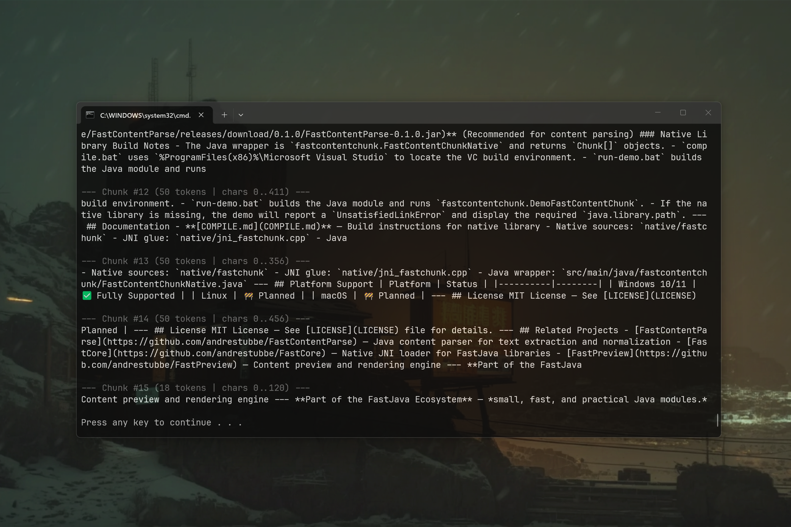

# FastContentChunk 0.1.3 [ALPHA-2026-08] — High-Performance Tokenizer and Strategy Engine for Java

[](https://github.com/andrestubbe/FastContentChunk/releases/tag/0.1.3)
[](https://opensource.org/licenses/MIT)
[](https://www.java.com)
[]()
[](https://jitpack.io/#andrestubbe/FastContentChunk)

---

**⚡ High-performance native SIMD tokenizer and multi-mode strategy chunker for RAG pipelines.**

`FastContentChunk` provides a SIMD-accelerated native tokenizer and hierarchical multi-mode chunking engine for Java. It is designed to work alongside **[FastContentParse](https://github.com/andrestubbe/FastContentParse)**, **[FastAIVectorDB](https://github.com/andrestubbe/FastAIVectorDB)**, and **[FastAIRag](https://github.com/andrestubbe/FastAIRag)** to accelerate text segmenting and Parent-Child context retention.

[](https://youtu.be/WraHz6LHKSU)

---

## Quick Start — Example

```java
import fastcontentchunk.FastContentChunk;
import fastcontentchunk.ChunkConfig;
import fastcontentchunk.ChunkMode;
import fastcontentchunk.Chunk;

public class Demo {
    public static void main(String[] args) {
        String text = "Paragraph 1...\n\nParagraph 2 with extended details...";

        // 1. Initialize Chunker & Strategy Config
        FastContentChunk chunker = new FastContentChunk();
        ChunkConfig config = new ChunkConfig(512, 64, ChunkMode.RECURSIVE);

        // 2. Execute Chunking
        Chunk[] chunks = chunker.chunk(text, config);

        // 3. Inspect Results (Small Chunk for Vector Search, Parent Text for Prompt)
        for (Chunk chunk : chunks) {
            System.out.printf("Chunk #%d [%d tokens]: %s\n", chunk.id, chunk.tokenCount, chunk.text);
            System.out.printf("  ↳ Parent Context (%d chars)\n", chunk.parentText.length());
        }
    }
}
```

---

## Table of Contents

- [Why FastContentChunk?](#why-fastcontentchunk)
- [Key Features](#key-features)
- [Real-World Use Cases](#real-world-use-cases)
- [Performance Benchmarks](#performance-benchmarks)
- [Architecture Overview](#architecture-overview)
- [API Quick Reference](#api-quick-reference)
- [Installation](#installation)
- [Documentation](#documentation)
- [Platform Support](#platform-support)
- [License](#license)
- [Related Projects](#related-projects)

---

## Why FastContentChunk?

Standard Java tokenization libraries often struggle with performance when processing large multi-page documents, destroying sentence structure and causing LLM hallucinations. `FastContentChunk` addresses this by:

- **SIMD Acceleration** — Uses native C++ AVX2 vector instructions for ultra-fast boundary scanning.
- **Hierarchical Multi-Mode Strategies** — Supports `RECURSIVE`, `PARAGRAPHS`, `SENTENCES`, and `TOKENS` modes.
- **Parent-Child Retrieval** — Attaches full section context (`parentText`) to every chunk for zero context-loss LLM prompts.
- **Abbreviation Protection** — Intelligent lookahead regex preventing false sentence breaks on titles (`Dr. med.`) and acronyms (`e.g.`, `99.8%`).

---

## Key Features

* **⚡ Native AVX2 SIMD Tokenizer** — Uses 32-byte C++ AVX2 vector instructions (`_mm256_cmpeq_epi8`) for sub-microsecond whitespace token scanning.
* **🧩 Hierarchical Multi-Mode Strategy Engine** — Supports `RECURSIVE`, `PARAGRAPHS`, `SENTENCES`, and `TOKENS` strategies.
* **🧠 Parent-Child Context Retention** — Links small `chunk.text` embeddings with large `chunk.parentText` contexts for zero context-loss LLM prompts.
* **⚡ Zero-Allocation Native JNI** — Direct `chunkToOffsets` native API returning flat `int[]` offset pairs to eliminate JVM GC allocations.
* **🛡️ Intelligent Sentence Protection** — Prevents chunk splits inside abbreviations (`Dr.`, `med.`), decimals (`99.8%`), and quote blocks.

---

## Real-World Use Cases

- 📄 **Large Scale Document Chunking**: Segment multi-megabyte PDFs and Markdown text streams into RAG passages in milliseconds.
- 🤖 **Parent-Child RAG Context Pipeline**: Store 128-token embeddings in vector DB while retaining 1024-token parent context for LLM generation.
- 🔍 **Real-Time Log Stream Segmentation**: Scan live server log streams for structural boundaries with zero JVM heap garbage allocations.
- ⚖️ **Legal Contract & Statute Partitioning**: Preserve full paragraph integrity without breaking mid-clause or mid-acronym.

---

## Performance Benchmarks

`FastContentChunk` is designed for ultra-low latency tokenization and passage chunking. In the official [JMH Benchmark](examples/Benchmark), the system measured throughput across native AVX2 offset scanning and hierarchical recursive chunking:

```text
Benchmark                             Mode  Cnt      Score   Error  Units
JMH_Chunk.benchmarkNativeAVX2Offsets thrpt    2  58126.877          ops/s
JMH_Chunk.benchmarkRecursiveChunking thrpt    2   6179.519          ops/s
```

> **58,000+ Operations per Second (Zero-Allocation)**: With the native AVX2 SIMD `chunkToOffsets` JNI engine, `FastContentChunk` processes document token boundaries at **over 58,000 Operations per Second** (58 ops/ms) with **0 JVM Garbage Collection allocations**. Even rich hierarchical `RECURSIVE` chunking with Parent-Child context generation executes at **6,100+ Operations per Second**.

---

## Architecture Overview

**[FastContentParse](https://github.com/andrestubbe/FastContentParse) (The Parser)**  
Converts unstructured binary documents (PDF, RTF, Markdown, TXT) into normalized UTF-8 text streams.

**FastContentChunk (This Library — The Strategy Engine)**  
Segments normalized text streams into contextual passages with Parent-Child context.

**[FastAIVectorDB](https://github.com/andrestubbe/FastAIVectorDB) (The Vector Store)**  
High-speed native C++ SIMD vector database storing small `chunk.text` embeddings for sub-5ms similarity retrieval.

**[FastAIRag](https://github.com/andrestubbe/FastAIRag) (The Orchestration Pipeline)**  
Higher-level RAG framework that orchestrates **[FastContentParse](https://github.com/andrestubbe/FastContentParse)** and **FastContentChunk**, indexes small `chunk.text` embeddings into **[FastAIVectorDB](https://github.com/andrestubbe/FastAIVectorDB)**, and feeds `chunk.parentText` to **[FastAIBot](https://github.com/andrestubbe/FastAIBot)** for LLM response generation.

---

## API Quick Reference

| Method | Description | Path |
|--------|-------------|------|
| `chunk(String)` | Chunks text using default `RECURSIVE` configuration. | [Reference 📖](docs/REFERENCE.md#chunk) |
| `chunk(String, ChunkConfig)` | Chunks text using custom strategy config. | [Reference 📖](docs/REFERENCE.md#chunkconfig) |

---

## Installation

### Option 1: Maven (Recommended)

Add the JitPack repository and the complete dependency stack to your `pom.xml`:

```xml
<repositories>
    <repository>
        <id>jitpack.io</id>
        <url>https://jitpack.io</url>
    </repository>
</repositories>

<dependencies>
    <!-- FastContentChunk Engine -->
    <dependency>
        <groupId>com.github.andrestubbe</groupId>
        <artifactId>FastContentChunk</artifactId>
        <version>0.1.3</version>
    </dependency>

    <!-- FastSIMD Hardware Vector Acceleration Engine -->
    <dependency>
        <groupId>com.github.andrestubbe</groupId>
        <artifactId>FastSIMD</artifactId>
        <version>0.1.3</version>
    </dependency>

    <!-- FastMemory Aligned Allocator -->
    <dependency>
        <groupId>com.github.andrestubbe</groupId>
        <artifactId>FastMemory</artifactId>
        <version>0.1.1</version>
    </dependency>

    <!-- FastPointer Address Wrapper -->
    <dependency>
        <groupId>com.github.andrestubbe</groupId>
        <artifactId>FastPointer</artifactId>
        <version>0.1.1</version>
    </dependency>

    <!-- FastCore Native Loader -->
    <dependency>
        <groupId>com.github.andrestubbe</groupId>
        <artifactId>FastCore</artifactId>
        <version>0.1.0</version>
    </dependency>
</dependencies>
```

### Option 2: Gradle (via JitPack)

```groovy
repositories {
    maven { url 'https://jitpack.io' }
}

dependencies {
    implementation 'com.github.andrestubbe:FastContentChunk:0.1.3'
    implementation 'com.github.andrestubbe:FastSIMD:0.1.3'
    implementation 'com.github.andrestubbe:FastMemory:0.1.1'
    implementation 'com.github.andrestubbe:FastPointer:0.1.1'
    implementation 'com.github.andrestubbe:FastCore:0.1.0'
}
```

### Option 3: Direct Download (No Build Tool)

Download the required JARs directly to add them to your classpath:

1. ⚡ **[FastContentChunk-0.1.3.jar](https://github.com/andrestubbe/FastContentChunk/releases/download/0.1.3/FastContentChunk-0.1.3.jar)** (The Core Library)
2. 🚀 **[FastSIMD-0.1.3.jar](https://github.com/andrestubbe/FastSIMD/releases/download/0.1.3/FastSIMD-0.1.3.jar)** (Hardware Vector Acceleration Engine)
3. 💾 **[FastMemory-0.1.1.jar](https://github.com/andrestubbe/FastMemory/releases/download/0.1.1/FastMemory-0.1.1.jar)** (32-Byte Aligned Allocator)
4. 📍 **[FastPointer-0.1.1.jar](https://github.com/andrestubbe/FastPointer/releases/download/0.1.1/FastPointer-0.1.1.jar)** (Primitive Address Pointer)
5. ⚙️ **[fastcore-0.1.0.jar](https://github.com/andrestubbe/FastCore/releases/download/0.1.0/fastcore-0.1.0.jar)** (Mandatory Native Loader)

> [!IMPORTANT]
> All JARs must be included in your classpath for the native SIMD JNI bindings to function correctly.

---

## Documentation

- **[CHANGELOG.md](docs/CHANGELOG.md)**: Version history and release notes.
- **[COMPILE.md](docs/COMPILE.md)**: Full compilation guide (MSVC C++17 build chain + JNI Setup).
- **[REFERENCE.md](docs/REFERENCE.md)**: Full API descriptions, border configurations, and codepoint index.
- **[PHILOSOPHY.md](docs/PHILOSOPHY.md)**: The engineering rationale for zero-allocation performance.
- **[ROADMAP.md](docs/ROADMAP.md)**: Future milestones and planned features.

---

## Platform Support

| Platform | Status |
|----------|--------|
| Windows 10/11 (x64) | ✅ Fully Supported |
| Linux | 🔄 Planned |
| macOS | 🔄 Planned |

---

## License

MIT License — See [LICENSE](LICENSE) file for details.

---

## Related Projects

- [FastContentParse](https://github.com/andrestubbe/FastContentParse) — Standardized Java document parser for text extraction and normalization
- [FastAIVectorDB](https://github.com/andrestubbe/FastAIVectorDB) — High-speed native C++ SIMD vector database
- [FastAIRag](https://github.com/andrestubbe/FastAIRag) — Retrieval-Augmented Generation pipeline client
- [FastCore](https://github.com/andrestubbe/FastCore) — Native JNI loader for FastJava libraries
- [FastAI](https://github.com/andrestubbe/fastai) — Unified lightweight AI model client interface
- [FastAIModel](https://github.com/andrestubbe/FastAIModel) — Embedded GGUF and ONNX runtimes for local feature embeddings
- [FastAIBot](https://github.com/andrestubbe/FastAIBot) — Autonomous conversational AI bot engine
- [FastAIAgent](https://github.com/andrestubbe/FastAIAgent) — Autonomous agentic workflow execution framework

---

Part of the FastJava Ecosystem — Making the JVM faster. Small package. Maximum speed. Zero bloat. ⚡
